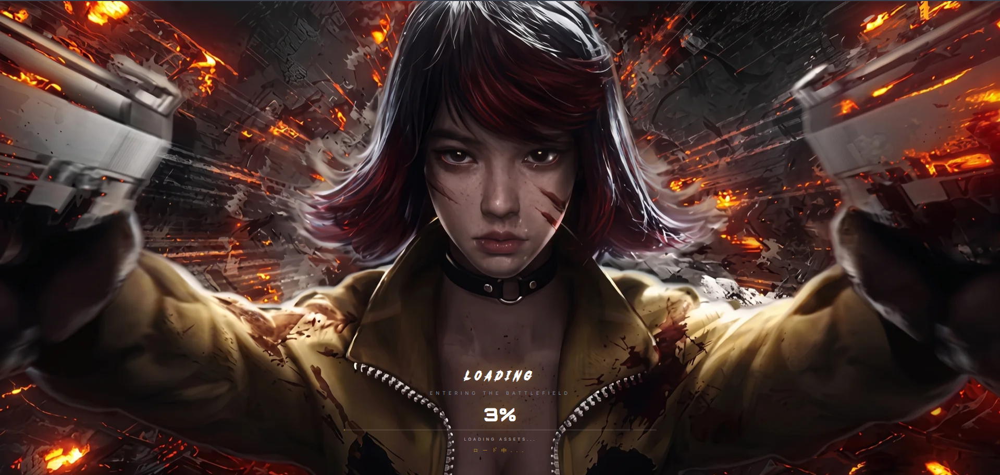
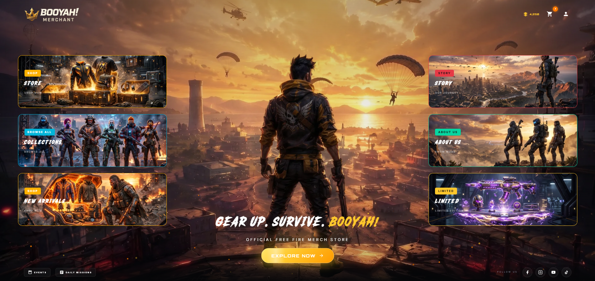
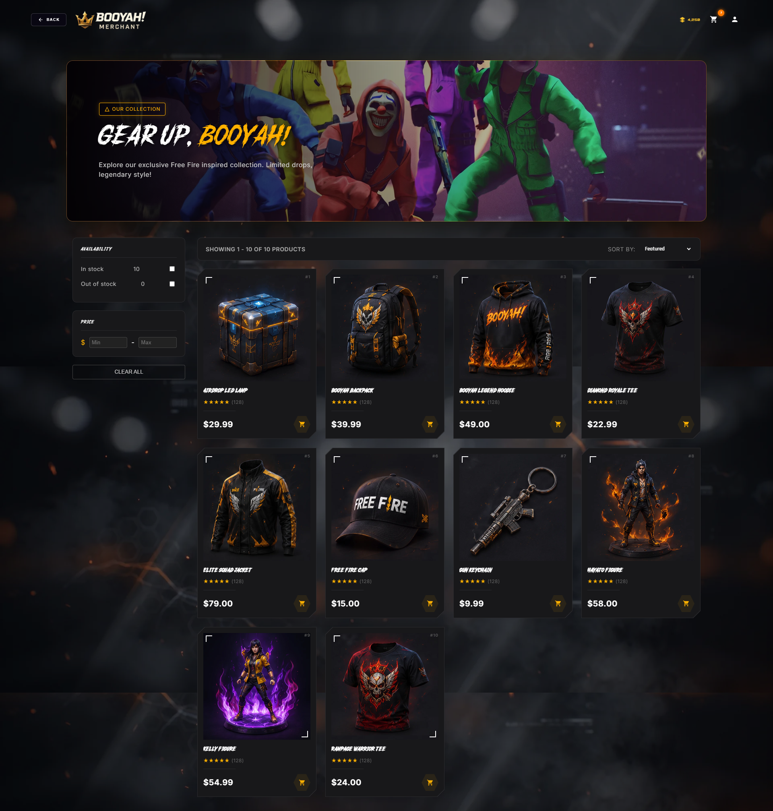
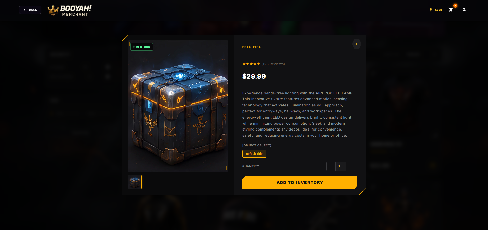
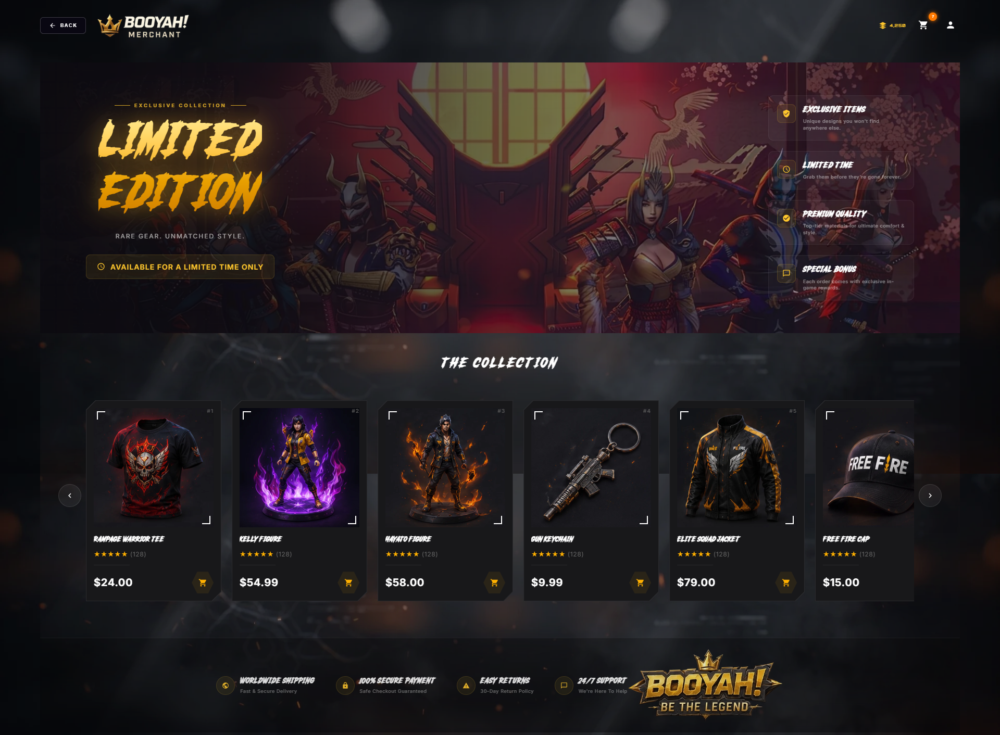
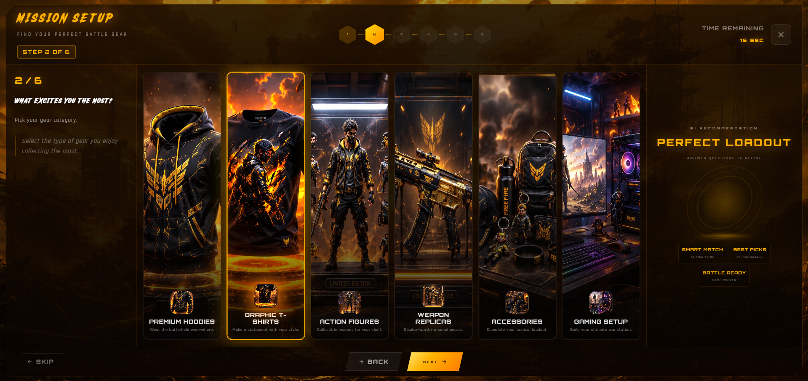
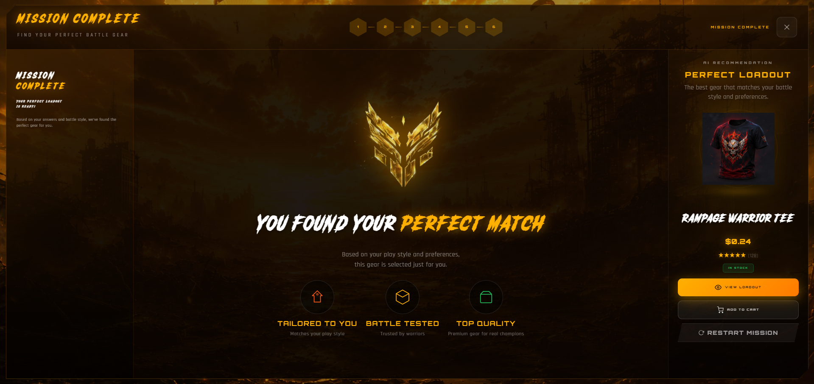

<div align="center">


<br/>
<br/>

```
██████╗  ██████╗  ██████╗ ██╗   ██╗ █████╗ ██╗  ██╗██╗
██╔══██╗██╔═══██╗██╔═══██╗╚██╗ ██╔╝██╔══██╗██║  ██║██║
██████╔╝██║   ██║██║   ██║ ╚████╔╝ ███████║███████║██║
██╔══██╗██║   ██║██║   ██║  ╚██╔╝  ██╔══██║██╔══██║╚═╝
██████╔╝╚██████╔╝╚██████╔╝   ██║   ██║  ██║██║  ██║██╗
╚═════╝  ╚═════╝  ╚═════╝    ╚═╝   ╚═╝  ╚═╝╚═╝  ╚═╝╚═╝
```

### 💥 *Gear Up. Survive. BOOYAH!* 🔥

<br/>

[](https://shopify.com)
[](#)
[](#)
[](#)
[](#)

<br/>

> **BOOYAH!** is not a traditional multi-page store.  
> It's a **single-page gaming lobby** — one immersive environment where every interaction (shop, story, limited edition, product matching) opens as a modal overlay **without ever leaving or reloading the page.**  
> *Built like a game. Runs like a game.*

</div>

---

<br/>

## ⚡ The Core Concept — Why This Is Different

Most Shopify stores navigate between pages. BOOYAH! doesn't.

```
  TRADITIONAL STORE                    BOOYAH! LOBBY
  ─────────────────                    ──────────────
  Home Page                            ┌──────────────────────────┐
      ↓  [click] → reload              │                          │
  Shop Page                            │   SINGLE GAMING LOBBY    │
      ↓  [click] → reload              │                          │
  Product Page                         │  Click anything →        │
      ↓  [click] → reload              │  Modal opens OVER lobby  │
  Cart Page                            │  Close → still in lobby  │
      ↓  [click] → reload              │  Zero reloads. Always.   │
  Checkout                             │                          │
                                       └──────────────────────────┘
```

Every section — Shop, Story, Limited Edition, Product Matching — is a **modal layer** that opens on top of the lobby. The player never loses their place. The vibe never breaks.

<br/>

---

## 🖥️ Preview — Full Flow


<br/>

---

## 🗺️ Lobby Architecture — What's Inside

```
╔══════════════════════════════════════════════════════════════════════╗
║                                                                      ║
║   💥  BOOYAH! — SINGLE PAGE LOBBY STRUCTURE                         ║
║                                                                      ║
║   ┌──────────────────────────────────────────────────────────────┐  ║
║   │                                                              │  ║
║   │   🔴  LOADING SCREEN                                         │  ║
║   │       Cinematic anime character intro with fire effects      │  ║
║   │       Loading bar animation before lobby entry               │  ║
║   │                                                              │  ║
║   ├──────────────────────────────────────────────────────────────┤  ║
║   │                                                              │  ║
║   │   🏠  MAIN LOBBY  ←── The only "page" that ever exists      │  ║
║   │       Dark battlefield hero — "GEAR UP. SURVIVE. BOOYAH!"   │  ║
║   │       Navigation triggers → open modals, never navigate      │  ║
║   │                                                              │  ║
║   ├──────────────────────────────────────────────────────────────┤  ║
║   │                                                              │  ║
║   │   🛍️  [MODAL] SHOP          — product grid overlay           │  ║
║   │   📦  [MODAL] PRODUCT       — single item detail overlay     │  ║
║   │   📖  [MODAL] STORY         — about/lore overlay             │  ║
║   │   🏆  [MODAL] LIMITED ED.   — exclusive drop overlay         │  ║
║   │   🎯  [MODAL] EXPLORE NOW   — product matching quiz overlay  │  ║
║   │   ✅  [MODAL] RESULT        — "You Found Your Perfect Match" │  ║
║   │                                                              │  ║
║   └──────────────────────────────────────────────────────────────┘  ║
║                                                                      ║
╚══════════════════════════════════════════════════════════════════════╝
```

<br/>

---

## 🔴 Loading Screen



A full-screen **cinematic intro** that plays before the lobby loads — fire-lit battlefield, anime character art bursting through the frame, and a loading bar that counts up to 100%. Sets the tone before a single product is seen.

<br/>

---

## 🏠 Main Lobby (Homepage)



The **permanent base layer** — the only true "page" in the experience. A dark, smoke-and-fire battlefield hero with the tagline *"GEAR UP. SURVIVE. BOOYAH!"* All navigation from here triggers modal overlays, not page navigations.

<br/>

---

## 🛍️ Shop Modal



Clicking **Shop** opens a full-screen modal overlay on top of the lobby. Inside: the complete product grid — mystery boxes, skins, gear drops, and character bundles — all browsable without leaving the lobby environment.

**Key details:**
- Opens as overlay — lobby visible behind
- Product grid with price tags
- Click any product → opens Product Modal (nested)
- Close button returns to lobby instantly

<br/>

---

## 📦 Product Modal



Clicking a product from the Shop Modal opens a **nested Product Modal** — a focused card showing the item image, name, price (`$25.00`), description, and an **ADD TO INVENTORY** button (Shopify's Add to Cart, re-skinned for the game world).

```
  [ Shop Modal ]
       └── [ Product Modal ]  ←── nested overlay, no reload
               └── Add to Inventory → Shopify cart
```

<br/>

---

## 📖 Story Modal


The **ABOUT / STORY** modal opens the lore of BOOYAH! — who they are, their mission stats, team members, and a *"We Are The Game"* manifesto section — all delivered as an immersive scrollable overlay with character art and battlefield photography.

**Sections inside the Story Modal:**
- Hero character banner with stats
- "Why Choose BOOYAH?" — reason tiles
- "Who We Are" — brand manifesto with team art
- "We Are The Game" — showcase photo grid with character profiles

<br/>

---

## 🏆 Limited Edition Modal



A dedicated **Limited Edition drop page** that opens as a modal — bold gold-on-black *"LIMITED EDITION"* header, a curated collection grid of exclusive drops, and the BOOYAH! brand mark stamped across the bottom. Exclusive items only accessible through this overlay.

<br/>

---

## 🎯 Explore Now — Product Matching Modal



The most unique feature — an **interactive product matching quiz** that opens as a modal. Players answer mission-style prompts (Mission Setup, Loadout, etc.) and the system narrows down their perfect gear match. Built entirely in the overlay layer — no navigation, no reload.

```
  MISSION SETUP  →  LOADOUT CHOICE  →  ...  →  PERFECT LOADOUT FOUND
       ◄──────────── progress tracked in modal state ────────────►
```

<br/>

---

## ✅ Product Result Modal



After the product matching quiz completes, a final **Result Modal** reveals: *"YOU FOUND YOUR PERFECT MATCH"* — displaying the recommended product ("RAMPAGE WARRIOR T12") with the BOOYAH! insignia. One-click add to cart from here.

<br/>

---

## 🎨 Design System

<br/>

### 🎨 Color Palette

```css
:root {
  /* ── Backgrounds ── */
  --color-bg-void:         #0d0d0d;   /* ██ Deep Game Black         */
  --color-bg-card:         #1a1a1a;   /* ██ Dark Modal Surface      */
  --color-bg-overlay:      #000000cc; /* ██ Semi-transparent Overlay*/

  /* ── Brand Accents ── */
  --color-booyah-gold:     #FFB800;   /* ██ Primary Gold / CTA      */
  --color-booyah-orange:   #FF6B00;   /* ██ Fire Orange Accent      */
  --color-booyah-red:      #EF3340;   /* ██ Danger / Alert Red      */

  /* ── Text ── */
  --color-text-primary:    #FFFFFF;   /* ██ White                   */
  --color-text-gold:       #FFB800;   /* ██ Gold Highlight          */
  --color-text-muted:      #888888;   /* ██ Muted Gray              */
}
```

<br/>

### 🔤 Typography

| Role | Font | Weight | Use Case |
|------|------|--------|----------|
| Game Title | `Bebas Neue` | 400 | "BOOYAH!", "LIMITED EDITION" |
| Hero Display | `Barlow Condensed` | 800 | "GEAR UP. SURVIVE." |
| HUD / Stats | `Space Mono` | 400 | Mission stats, counters |
| Body | `Inter` | 400 | Modal descriptions |
| CTA Buttons | `Oswald` | 600 | "ADD TO INVENTORY", "EXPLORE" |

<br/>

---

## 📁 Project Structure

```
booyah/
│
├── 📂 assets/
│   └── 📂 ss/
│       ├── 🖼️  loading-screen.png
│       ├── 🖼️  homepage.png
│       ├── 🖼️  shop.png
│       ├── 🖼️  product-modal.png
│       ├── 🖼️  story.png
│       ├── 🖼️  limited-edition.png
│       ├── 🖼️  explore-now.png
│       └── 🖼️  result.png
│
├── 📂 sections/
│   └── main-lobby.liquid          # The ONE section — everything else is JS modals
│
├── 📂 snippets/
│   ├── modal-shop.liquid
│   ├── modal-product.liquid
│   ├── modal-story.liquid
│   ├── modal-limited-edition.liquid
│   ├── modal-explore.liquid
│   └── modal-result.liquid
│
├── 📂 assets/
│   ├── lobby.js                   # Modal open/close controller
│   ├── product-matching.js        # Quiz logic & state
│   ├── loading-screen.js          # Intro animation
│   └── theme.css
│
├── 📂 templates/
│   └── index.json                 # Single template — everything lives here
│
└── 📄 README.md                   # ← You are here
```

<br/>

---

## ⚙️ How The Modal System Works

```javascript
// Every nav item triggers a modal — never a page load
document.querySelectorAll('[data-modal-trigger]').forEach(trigger => {
  trigger.addEventListener('click', (e) => {
    e.preventDefault()                          // ← no navigation
    const target = trigger.dataset.modalTrigger
    openModal(target)                           // ← open overlay instead
  })
})

// Modals stack — product modal opens inside shop modal
function openModal(id) {
  document.getElementById(`modal-${id}`).classList.add('active')
  document.body.classList.add('modal-open')
}

function closeModal(id) {
  document.getElementById(`modal-${id}`).classList.remove('active')
}
```

**Result:** Zero page reloads. The lobby background always stays alive underneath every overlay. The immersion never breaks.

<br/>

---

## ⚡ Performance

```
🟢  PageSpeed Score (Desktop)    →   94 / 100
🟢  Largest Contentful Paint     →   < 2.1s
🟢  Cumulative Layout Shift      →   < 0.03
🟡  Time to Interactive          →   < 2.5s   (loading screen intentional)
🟡  First Input Delay            →   < 90ms
```

> **Note:** The loading screen animation adds ~1.5s of intentional delay — this is a **design feature**, not a performance issue. It sets the game-lobby atmosphere before the main content appears.

<br/>

---

## 🚀 Getting Started

```bash
# 1. Clone the repository
git clone https://github.com/arnavasif/booyah.git
cd booyah

# 2. Install Shopify CLI
npm install -g @shopify/cli @shopify/theme

# 3. Connect to your store
shopify auth login --store=your-store.myshopify.com

# 4. Run locally
shopify theme dev --store=your-store.myshopify.com

# 5. Push live
shopify theme push
```

<br/>

---

## 🤝 Contributing

```bash
git checkout -b feature/new-modal
git commit -m "💥 Add: new game modal overlay"
git push origin feature/new-modal
# Open a Pull Request 🎉
```

### Commit Convention

| Emoji | Prefix | Meaning |
|-------|--------|---------|
| 💥 | `Add:` | New feature or modal |
| 🐛 | `Fix:` | Bug fix |
| 🎨 | `Style:` | Design / UI update |
| ⚡ | `Perf:` | Performance improvement |
| 📝 | `Docs:` | Documentation |
| 🔧 | `Config:` | Configuration change |

<br/>

---

## 📄 License

```
MIT License — © 2026 BOOYAH!

Free to use, modify, and distribute with attribution.
Built with 💥 fire for every player in the game.
```

<br/>

---

<div align="center">

```
██████╗  ██████╗  ██████╗ ██╗   ██╗ █████╗ ██╗  ██╗██╗
██╔══██╗██╔═══██╗██╔═══██╗╚██╗ ██╔╝██╔══██╗██║  ██║██║
██████╔╝██║   ██║██║   ██║ ╚████╔╝ ███████║███████║██║
██╔══██╗██║   ██║██║   ██║  ╚██╔╝  ██╔══██║██╔══██║╚═╝
██████╔╝╚██████╔╝╚██████╔╝   ██║   ██║  ██║██║  ██║██╗
╚═════╝  ╚═════╝  ╚═════╝    ╚═╝   ╚═╝  ╚═╝╚═╝  ╚═╝╚═╝
```

**Built with 💥 and 🔥 for every warrior in the lobby.**

[](https://github.com/yourusername/booyah)

<br/>

*One page. Zero reloads. Pure game.*

</div>
